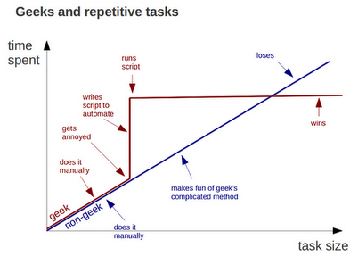

# Termicoder

[](https://travis-ci.org/termicoder/termicoder)
[](https://pypi.python.org/pypi/termicoder)
[](https://pypi.python.org/pypi/termicoder)
[](https://pypi.python.org/pypi/termicoder)
[](https://requires.io/github/termicoder/termicoder/requirements/?branch=master)
[](https://github.com/termicoder/termicoder/blob/master/LICENSE.txt)

View, Code, Submit directly from terminal  
Made with :heart: by [Divesh Uttamchandani](https://github.com/diveshuttam)

## A python based command line interface for helping in competitive programming. Termicoder aims at automating and simplifying the process of coding, testing and submitting solutions to Online Judges so that one can concentrate only on algorithms

<h3 align="center">
Inspiration behind Termicoder
</h3>
<p align="center">
  
</p>

## Installation

### User installation

`pip install termicoder`
use sudo -H if required. preferably use pip3 (python3)

### Developer installation

- clone this repo
- in the root folder of this repo run
  - `pip install --editable .`

notice the dot(.) in above command at the end

Note: it is better to use virtualenv and pip3 (python3)

- to remove this package, in the root folder of the repo run
  - `python setup.py develop --uninstall`

**Note: Termicoder is in its development stage and has only been tested on Ubuntu + python3. Support for other configurations is being worked on, if you are using some other platform and encounter errors, do create an [issue](https://github.com/diveshuttam/termicoder/issues) for them. For windows one can also try using [Bash on Ubuntu on Windows](https://msdn.microsoft.com/en-us/commandline/wsl/about) ; most features have been tested out there and work as expected.**

### Autocomplete for bash

To setup tab autocompletion for termicoder commands,
see `termicoder config autocomplete --help`

## Current Support

### Judges Included

1. [CodeChef](http://www.codechef.com)

### Languages Support Included

1. C
2. C++
3. Python2/3

## Highlights

```
Usage: termicoder [OPTIONS] COMMAND [ARGS]...

  __       __                      _                __
  \ \     / /____  _________ ___  (_)________  ____/ /__  _____
   \ \   / __/ _ \/ ___/ __ `__ \/ / ___/ __ \/ __  / _ \/ ___/
   / /  / /_/  __/ /  / / / / / / / /__/ /_/ / /_/ /  __/ /
  /_/   \__/\___/_/  /_/ /_/ /_/_/\___/\____/\__,_/\___/_/

  view, code & submit problems directly from terminal.

Options:
  --version            Show the version and exit.
  -v, --verbosity LVL  Either CRITICAL, ERROR, WARNING, INFO or DEBUG
  -h, --help           Show this message and exit.

Commands:
  clip    Copies code from file to clipboard.
  code    Creates and opens file with template code.
  config  Configure settings, autocomplete etc.
  debug   Launches custom debug interface.
  list    List the contents of current folder.
  repl    Start an interactive shell.
  setup   Sets up problem, contests and login.
  submit  Submit a solution.
  test    Test code against the sample testcases.
  view    View contests and problems.
```

## Detailed Command Help

For details of a particular command use:

```bash

termicoder --help
termicoder <COMMAND> --help
```

or you can have a look at [helptext](documentation/helptext.md) which contains the output of all help commands

## Sample Run

For a sample we recommend going through [sample run](documentation/samplerun.md)
which contains the details

## ChangeLog

ChangeLog and Older Releases are availible under [Releases](https://github.com/termicoder/termicoder/releases) .

## Contributing to Termicoder

Termicoder is mostly written in python.
If you are looking towards contributing to the code base, you should begin with reading the following:

- [CONTRIBUTING](CONTRIBUTING.md)
- [GUIDELINES](documentation/guidelines.md)
- [IDEAS](https://github.com/termicoder/termicoder/blob/master/documentation/ideas.md).

You can also contribute otherwise by

- Improving the Documentation.
  - Most of the documentation lies in the [documentation](https://github.com/termicoder/termicoder/tree/master/documentation) folder. To start fork this repo, change and create a pull request

- reporting a bug or requesting a feature.
  - Please create an [issue](https://github.com/termicoder/termicoder/issues) about the bug/feature.

- Giving feedback about the work. (both praise and criticism are equally appreciated).
  - mail : diveshuttamchandani@gmail.com

## LICENSE

[MIT](LICENSE.txt)

## NOTE

This is a complete redesign and rewrite of _termicoder_ to support judges as plugins,
As well as to support the new codechef API.

Unlike [previous implementation](https://github.com/termicoder/termicoder) this
completely does away with `exec` and `eval` calls. And implements `Judges`,
`Problems` and `Contests` as classes instead of modules.

There is an abstract class `Judge` which is used to dispatch operations to a
particular judge instance through `Judge Factory`.
Developers can subclass and implement the `Judge` class externally
and attach their module to setup tool entry-point - `termicoder.judge_plugins`.

Termicoder dynamically loads these judges and dispatches the operations.
Complete documentation for writing judge-plugins and the UML design docs for
termicoder would be available soon. By then you can look at the
`termicoder/judges/codechef` in this repo for an example implementation.
See setup.py for example of how to subscribe to entry point
`termicoder.judge_plugins`.

This distribution currently includes judge plugin `codechef` implemented using
[codechef api](http://developers.codechef.com/) for [codechef api hackathon powered by Alibaba](https://www.codechef.com/CAH1801)

There are also many completely new features implemented in this version including
`termicoder repl`, `termicoder config`, `termicoder clip`, `termicoder config autocomplete`

Though this implementation lacks support for colors as well as a few other
features which were present in previous implementation.
This is mostly due to time constraint of the hackathon. Codechef API
severely limits requests per time which slows down development.
We will try to get it running, once we have tested and perfected the
api based features.

This repo code will replace the [main termicoder repo](https://github.com/termicoder/termicoder) after this is perfected

You can use previous implementation of termicoder by specifying the version while pip
installation.
Previous implementation had version numbers `~0.2.*` and current implementation has
versions `~0.3.*`
Once all primary features are implemented we will shift to beta versions `~0.9.*` for develop branch and stable versions `~1.0.*` for master branch
